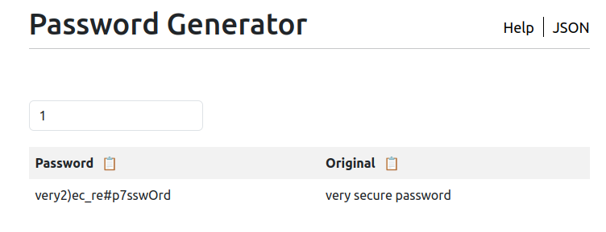

# password-generator
This is a customizable password generator written in Go, that creates strong and unique passwords based on a wordlist. <br> 
The generator combines three random words from the wordlist, capitalizes, maps, and inserts symbols defined in values.


#### For example, the following values:
```yaml
MIN_PASSWORD_LENGTH: 15
MAX_PASSWORD_LENGTH: 32
BETWEEN_SYMBOLS: "!@#$%"
INSIDE_SYMBOLS: "*()_+" 
```
#### would generate:


## Usage
Can be run locally as a docker image or deployed in Kubernetes ([how to](https://github.com/ta1ss/password-generator/tree/main/helm)). 


1. Prepare a wordlist and place it in `src/backend/wordlists/`
2. Modify configuration in `src/backend/values/values.yaml`
```yaml
MIN_PASSWORD_LENGTH: 15          # minimum length of the password
MAX_PASSWORD_LENGTH: 32          # maximum length of the password
BETWEEN_SYMBOLS: ""              # define symbols for between the words
INSIDE_SYMBOLS: ""               # define symbols for the words
PASSWORD_PER_ROUTINE: 300        # generated passwords per GO routine          
SYMBOL_MAPPING:                  # define which char you want to be swapped     
  key: value                     # value is mapped to key
WORDLIST_PATH: "wordlists/wordlist.txt"  # Path to wordlist

```
3. Build and Run Docker image
```bash
$ docker build -t password-generator . 
$ docker run -p 8080:8080 password-generator
```


## Testing

Testing is a complex task. Tests are located in the `k6` folder and run like this:
```bash
k6 run k6/loadtesting.js
```

## Security testing

Security scanning of the source code inside devcontainer:
```bash
trivy fs .
```